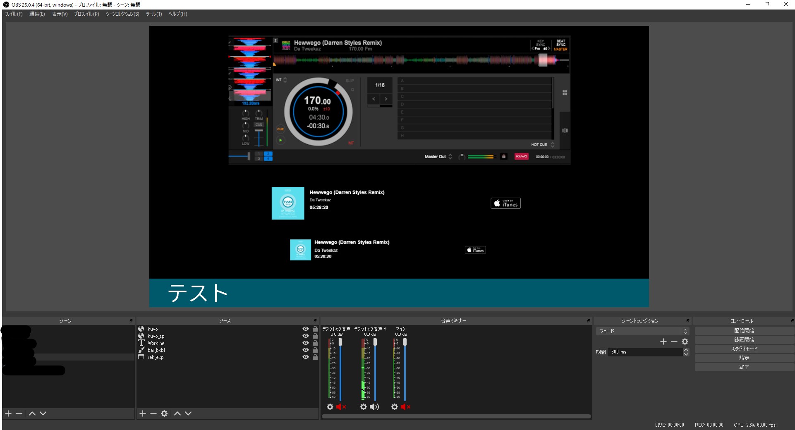
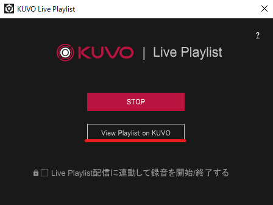
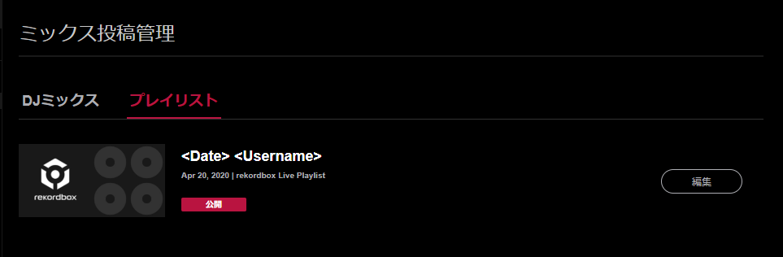
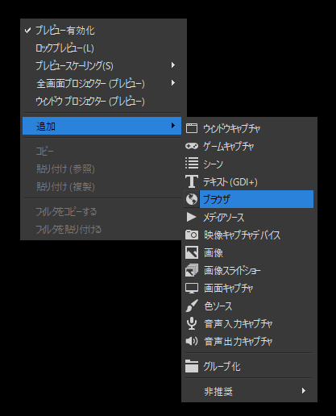
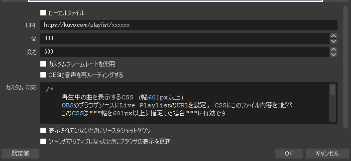
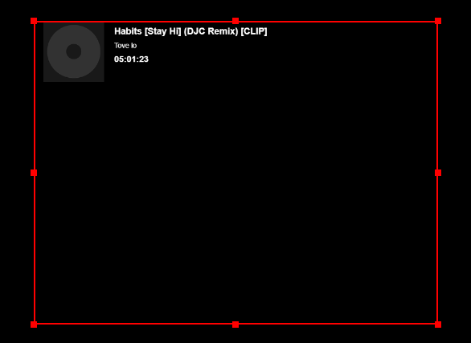

# kuvo-obs
KUVOのLive Playlist機能を用いてOBSに再生中の曲を表示するためのCSSです。\
rekordbox -> KUVO Live Playlist -> OBS(ブラウザ, CSS)\
欠点: 再生中の曲が切り替わるまでに数十秒を要するので、ウインドウキャプチャしたほうがいいかも

## KUVOの準備

### 1. KUVOのアカウントを作成し、rekordboxでログイン
https://kuvo.com/
### 2. PDFの10ページを参考に、Live Playlist機能を有効にする
https://kuvo.com/kuvoweb/docs/postdjmix/KUVO_DJmixPostingGuide_jp.pdf \
*rekordbox 6以降は多少手順が異なる場合があります。\
*録音は不要です。
### 3. 演奏開始後、プレイリストが公開されているか確認する
Live PlaylistをSTARTした後rekordboxで演奏を開始すると、演奏した曲がリアルタイムで公開されます。\
View Playlist on KUVOを押すとブラウザが開きます。\
プレイリスト一覧が表示されるので、現在演奏中のプレイリストを開きます。\
\

演奏した曲が公開されていればOKです。現在再生中の曲は黄緑色で表示されます。

## OBSの準備
### 1. ソースにブラウザを追加
ブラウザを作成します。\
 

### 2. プロパティでURLとCSSを設定
URLに、先ほど公開したプレイリストのURL https://kuvo.com/playlist/xxxxxx を設定します。\
カスタムCSSに、`kuvo_obs.css`の中身をコピペします。\
***幅を600以下に設定した場合は、`kuvo_obs_sp.css`の中身をコピペ**します。\
\

　\
OKを押すと、現在再生中の曲のみが表示されます。\
\
\
再度プロパティを開き、適切な高さにします。

## CSSができる人
背景色、文字色など自由に変更できる💪

## FAQ
### 曲名の端が切れて表示される
幅を601以上に設定した場合、文字が折り返されないので十分は幅を設定する必要があります。\
-> OBSでの幅を**1920以上**にすることをおすすめします。\
長い曲名はそれでも切れてしまう場合があるので、cssを編集して文字サイズを小さくするなどの工夫をお願いします。
### アートワークが表示されない
KUVOに登録されている曲でないとアートワークは表示できないようです。
### 再生中の曲が時々表示されない
KUVOの仕様で、再生中と認識できない場合があります。
